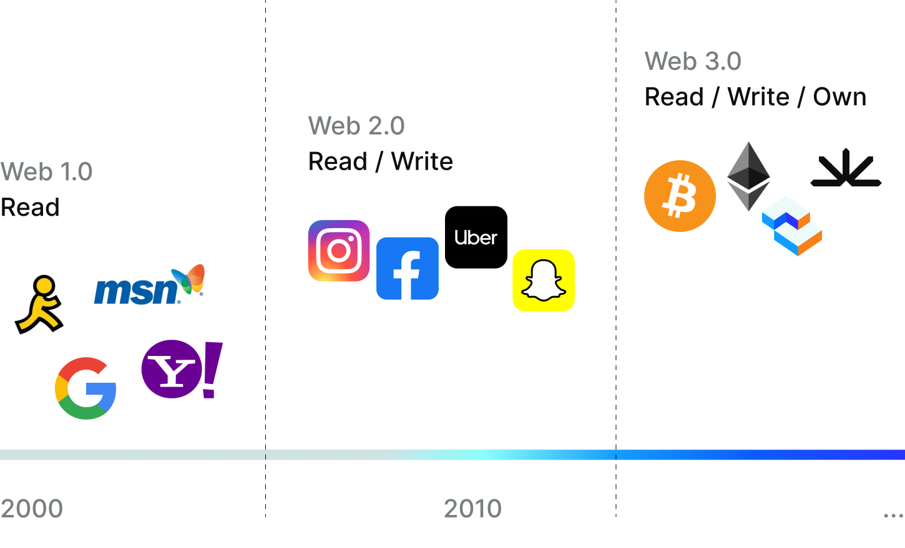

# What is Web3?

You may have heard of the latest iteration of the internet referred to as “Web3.” To understand Web3 and where the internet is headed, it’s helpful to first understand where it’s been.

**Web 1.0** was the early internet. It was primarily used for static content delivery (e.g., emails, browsing websites, and using electronic bulletin boards) and was controlled by a few centralized entities.

**Web 2.0** introduced the interactive web, which allowed for user-generated content, social networking, and e-commerce. However, it is still primarily controlled by centralized intermediaries and the lack of verifiable digital ownership prevented content creators from fully monetizing their online work and the lack of trustless transaction systems created a large risk for fraud and hacking.

**Web3,** also known as Web 3.0 or the decentralized web, is the next generation of the internet built on decentralized blockchain technology.

\

<figure><figcaption></figcaption></figure>

Web3 is focused on creating a more open, transparent, and decentralized internet, where users have greater control over their data and online identity. Unlike the current web, which relies on centralized servers and intermediaries, Web3 is powered by decentralized networks, where users can interact directly with each other and access applications without the need for intermediaries.

One of Web3’s biggest innovations is enabling secure and verifiable ownership of digital assets, including cryptocurrency and non-fungible tokens (NFTs). This has helped create new revenue streams for content creators and artists, streamlines fractional ownership of assets, and empowers efficient marketplaces for traditionally illiquid assets.

Web3 enables the creation of decentralized applications, or dApps, that operate on blockchain networks and are resistant to censorship and control by centralized authorities. These dApps can be used for a wide range of applications, such as decentralized finance, social media, gaming, and more.

Overall, Web3 is focused on creating a more open and equitable internet that is owned and controlled by its users, rather than a few centralized entities—empowering individuals and human freedom.\
