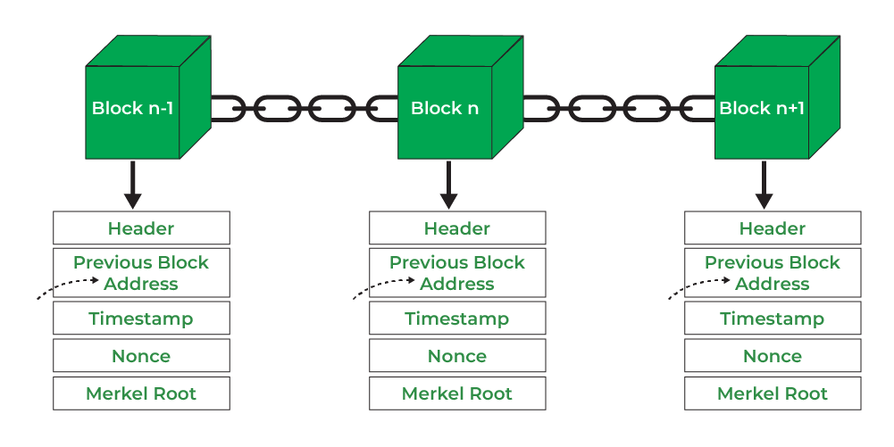

# Blockchain Technology

Blockchain or distributed ledger technology works by creating a digital ledger of transactions maintained across a network of computers. This network can be centralized or decentralized, depending on whether the given blockchain is public (like Bitcoin or Ethereum) or private (like a proprietary blockchain a company may create for wholly in-house use). Each transaction is verified and recorded by multiple computers on the network, creating a permanent and tamper-proof record.

When a new transaction is made, it is broadcast to the network, and the computers use complex cryptographic algorithms to verify and validate the transaction. Once verified, the transaction is added to a block, along with other verified transactions, and the block is added to the blockchain.

Each block in the blockchain contains a unique code, called a hash, that links it to the previous block in the chain. This creates a chain of blocks, with each block linked to the previous one, creating a permanent and tamper-proof record of all the transactions on the network. Thus, the name “blockchain.”

<figure><figcaption></figcaption></figure>

Because the ledger is distributed across a network of computers, there is no need for a central authority to manage and verify transactions. Instead, they are verified by a network of computers, the validity of their consensus determined by a consensus algorithm.  This makes the system more secure, as there is no single point of failure or vulnerability that can be exploited by hackers.&#x20;

Note: The most widely used consensus algorithm is Proof-of-Stake, an economically secure and energy efficient consensus algorithm.

Overall, blockchain or distributed ledger technology provides a transparent, secure, and decentralized way to record and verify transactions, making it ideal for a wide range of applications, from financial transactions to supply chain management and anticounterfeiting and beyond.

\
